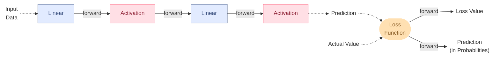
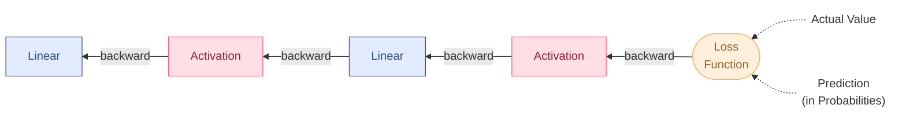
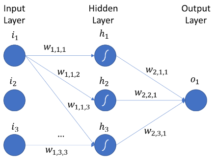
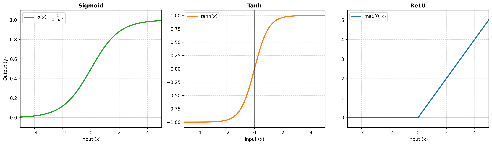
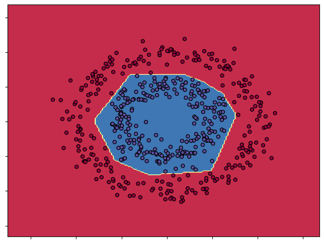
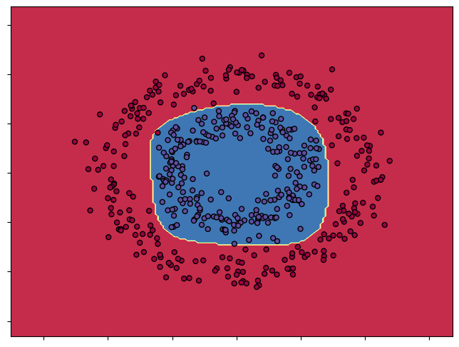
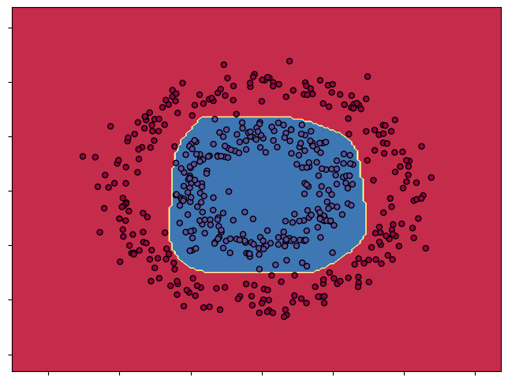
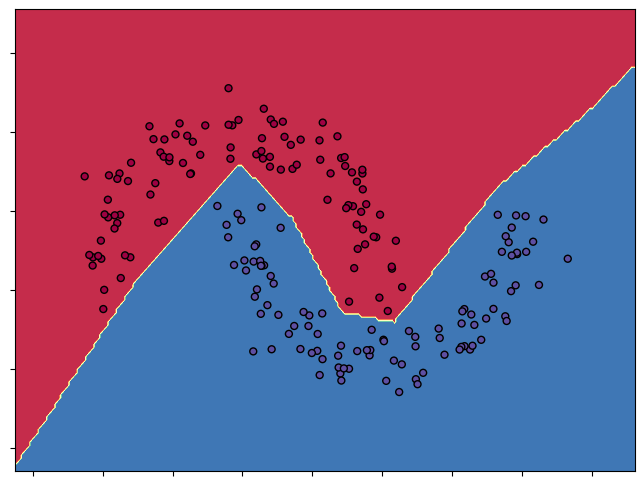
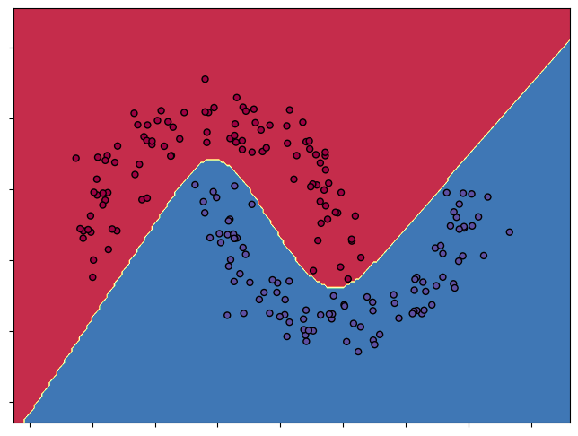
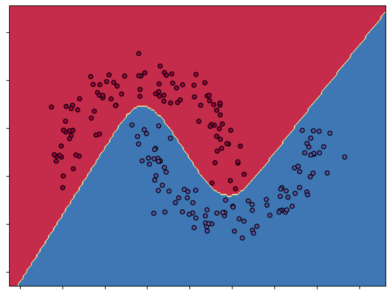

# MLP-from-scratch

A multi-layer perceptron built from scratch using only NumPy — no autograd, no PyTorch, no built-in layers. Built to understand backpropagation at the level of individual matrix operations.

## Table of Contents

- [Quickstart](#quickstart)
- [Thinking of Neural Networks in Layers Rather than Singular Neurons](#thinking-of-neural-networks-in-layers-rather-than-singular-neurons)
- [My Experience With Neural Networks](#my-experience-with-neural-networks)
- [Why This Looks Different from Ordinary MLP Visualizations](#why-this-looks-different-from-ordinary-mlp-visualizations)
- [Activation](#activation)
- [Results](#results-try-it-yourself-3)
- [Install](#install)
- [Design Notes](#design-notes)
- [What I'd Do Differently](#what-id-do-differently--next-steps)
- [Resources](#additional-information--resources)

## Quickstart

```python
import numpy as np

from mlp.layer import Linear
from mlp.activation import Tanh
from mlp.loss import SoftMaxCategoricalEntropy
from mlp.model import MLP

network = [
    Linear(2, 6), Tanh(),
    Linear(6, 3), Tanh(),
    Linear(3, 2)
]

model = MLP(
    network=network,
    loss_function=SoftMaxCategoricalEntropy(temp=1.0),
    learning_rate=0.1
)

model.fit(X, Y, epochs=2000, batch_size=20, print_every=500)
test_accuracy = np.mean(model.predict(X) == Y)
```

Requires Python 3.9+.

## Thinking of Neural Networks in Layers Rather than Singular Neurons

### Forward Pass

### Backward Pass


This isn't meant to be a fully accurate depiction of an MLP — it's meant to show how a supposedly "complicated" neural network actually works.


### My Experience With Neural Networks
We can think of a neural network as a chain of layers. But what *is* a `Layer`?
 
Some might say the layer isn't even the important part — it's the neuron that matters, hence "Neural Network," not "Layer Network." That's exactly where the misunderstanding begins. Others picture a layer as some "super complex" function with a bunch of `Neuron` nodes, each connecting to the next layer's neuron, similar to a `Linked List`.
 
Atleast, that's what I experienced. I used to be one of those people. I pictured these neurons and their "smart, complicated connectors" as something intimidating — the kind of thing that surely takes hundreds of lines of code.
 
But it turns out, a `Layer` is just a `class` that stores and computes two simple functions: `forward()`, which does the normal computation, and `backward()`, which essentially calculates the derivatives of each variable.
 
That's it.

### Why This Looks Different from Ordinary MLP Visualizations

Most MLP visualizations look like this:



This is misleading in a few ways:

1. **Weights and biases are drawn on the connectors, as if the transformation happens along the line between two neurons.** In reality, weights and biases live inside the layer itself — the connector is just showing you data flow, not computation.
2. **Each hidden layer bundles a linear transformation and a non-linear activation function into one unit.** Fusing two operations into a single class makes each one harder to test, debug, or swap independently — you can't isolate whether a bug is in the matrix multiply or in the activation's derivative, and you can't reuse the same activation across different linear layers without duplicating code. It also complicates the backward pass: the chain rule has to be derived through both operations at once inside a single block, instead of each operation implementing its own local derivative and letting composition handle the rest.
3. **The input layer, hidden layers, and output layer are drawn as identically-shaped circles, sometimes even the same color.** This implies they're all instances of the same `Layer` class, but the input "layer" isn't a layer at all — it's just a matrix of data. Beginners can walk away thinking data itself is a computational unit.

## Activation

For this project we use `Tanh`, `Sigmoid`, and `ReLU`, which as shown are all non-linear functions.



## Results (Try it Yourself :3)

Trained on the classic two-moons and concentric-circles datasets to visualize the decision boundary a from-scratch network learns. As you can see, the choice of activation function affects the sharpness of the decision boundary.

*Uses `np.random.seed(0)` for the dataset*

| ReLU Activation | Sigmoid Activation | Tanh Activation |
| :---: | :---: | :---: |
|  |  |  |

See [`examples/circles.ipynb`](examples/circles.ipynb) for the full training runs, weight updates, and epoch metrics.

*Uses `np.random.seed(10)` for the dataset*

| ReLU Activation | Sigmoid Activation | Tanh Activation |
| :---: | :---: | :---: |
|  |  |  |

See [`examples/two_moons.ipynb`](examples/two_moons.ipynb) for the full training runs, weight updates, and epoch metrics.

## Install

```bash
git clone https://github.com/JustLouisRC/MLP-from-scratch.git
cd MLP-from-scratch
pip install -r requirements.txt
```

## Design Notes

- **Composable layers.** Every layer (`Linear`, `Tanh`, `ReLU`, `Sigmoid`) shares the same `forward` / `backward` interface defined in `base.py`, so a network is just a list you chain together — `MLP` doesn't need to know what's inside it.
- **Gradients are computed inside the function** Each layer's `backward()` takes `learning_rate` directly and updates its own weights, rather than returning gradients to a separate optimizer.
- **Weight init**: `Linear` uses Xavier/Glorot uniform init to keep activations from vanishing or exploding early in training.

## What I'd Do Differently / Next Steps

- Decouple parameter updates from `backward()` into a separate `Optimizer` class (SGD, momentum, Adam)
- Build a small autograd engine from scratch and use it to compute derivatives automatically instead of hand-deriving each layer's gradient

## Additional Information / Resources

- [CS231n](http://cs231n.github.io/) — neural network fundamentals and backprop derivations
- [colah's blog on backpropagation](http://colah.github.io/posts/2015-08-Backprop/)

## License

MIT
